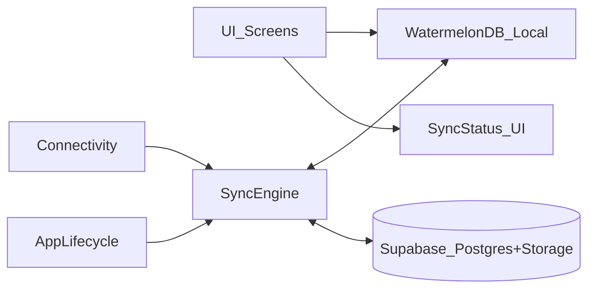

# Offline-first plan (WatermelonDB + Supabase)

## Current state (critical analysis)

- **Offline-first direction is correct**: UI is starting to read/write via WatermelonDB (e.g. local create/update), and you’ve drafted a `synchronize()`-based sync function.
- **But the implementation is currently inconsistent / incomplete**, so “delta sync” can’t be correct yet:
  - **Sync isn’t called anywhere**: `utils/sync.ts` exports `mySync()` but nothing invokes it.
  - **Schema mismatch vs delta sync**:
    - Your guide and sync code assume `updated_at` exists; local schema/model do not.
    - `db/model/schema.js` + `db/model/Task.js` currently have **no `updated_at`**, no `deleted_at`, and also miss fields your UI references (e.g. `image_url`).
  - **ID compatibility risk**:
    - Supabase expects `tasks.id` as `uuid` (per your guide), but WatermelonDB will auto-generate a non-UUID string unless you explicitly set it.
  - **Type mismatch risk on dates**:
    - Local uses numbers (ms), Supabase tables typically use `timestamptz` strings. Your current `pullChanges` returns raw Supabase rows without converting types.
  - **UI still hits Supabase directly**:
    - `api/tasks/*` fetches tasks from Supabase with React Query, and `app/(tabs)/index.tsx` still calls `useTasks()` (even though the list is WatermelonDB-driven).
  - **Deletes aren’t sync-safe**:
    - `destroyPermanently()` removes locally immediately; for offline-first you generally want `markAsDeleted()` + server-side tombstones (`deleted_at`) + pull deleted IDs.

## Target architecture

- **Local DB is the single source of truth**: screens read from WatermelonDB only.
- **Sync engine is the only layer talking to Supabase**.
- **Delta sync** based on server-authored `updated_at` and `deleted_at`.

## Plan (recommended path: keep WatermelonDB + improve)

### 1) Make the schema sync-capable (required)

- **Add required columns locally** (WatermelonDB):
  - `updated_at` (number, required)
  - `deleted_at` (number, optional) OR rely on Watermelon’s deletion status + server tombstones
  - any fields you already use in UI/sync: `image_url`, and ensure `due_date` is optional if it can be empty
- **Bump Watermelon schema version + add migrations**.
- **Update models** to include the new fields.

### 2) Make Supabase schema sync-capable (required)

- **Ensure server has**:
  - `updated_at timestamptz not null default now()`
  - `deleted_at timestamptz null` (for soft delete)
- **Add trigger(s)** to always update `updated_at = now()` on UPDATE.
- **Decide delete semantics**:
  - Recommended: soft delete by setting `deleted_at`.

### 3) Fix IDs (required)

- Ensure **client-generated IDs are UUID v4** (so offline-created tasks can be inserted remotely).
- Recommended packages/approach:
  - **`uuid` + `expo-crypto`** using `getRandomValues()` to generate UUID v4 reliably in Expo.

### 4) Implement correct pull/push transformations (required)

- **Pull**: convert Supabase rows → Watermelon raw records
  - Convert `created_at`, `updated_at`, `due_date`, `deleted_at` from ISO → ms number.
  - Return `changes` split into `created/updated` if you can; otherwise ensure “everything in updated” is still type-correct and safe.
  - Return a **server-derived `timestamp`** (avoid `Date.now()` if possible; clock skew can break delta sync).
- **Push**:
  - Prefer batching: upsert for created/updated (with server-side `updated_at`), and soft-delete update for deleted.
  - Avoid per-row update loops where possible.
  - Add retry/backoff and “stop on conflict” behavior.

### 5) Wire sync into the app lifecycle (required)

- Run sync:
  - on app start
  - when app returns to foreground
  - when connectivity becomes online
  - via manual pull-to-refresh
- Track sync state in a small store (e.g. Zustand): lastSyncedAt, isSyncing, lastError.

### 6) Remove remaining direct Supabase usage from UI (required)

- Tasks screens should:
  - read from WatermelonDB observers (`withObservables` / `observeWithColumns`)
  - write via `database.write()` only
- React Query for tasks should be removed or repurposed:
  - If you keep React Query, limit it to **sync-only endpoints** (not direct UI reads).

### 7) Expand offline-first beyond tasks (next)

- If comments/media must work offline:
  - add local tables + sync for `task_comments` and `task_media`
  - decide storage strategy for media:
    - store local file references + upload queue
    - store remote `image_url` after upload completes

## Alternative option (if you want “turnkey” local-first replication)

If you want less custom sync code and more “database replication” semantics, evaluate a Postgres-local-first sync layer:

- **PowerSync** (popular with Supabase/Postgres stacks): local SQLite + incremental sync.
- **ElectricSQL** (Postgres replication model): local-first primitives.

This path can reduce custom sync complexity (server timestamps, batching, conflict checks), but adds a new platform dependency and operational model.

## Acceptance criteria

- App works fully offline for tasks create/update/delete.
- On reconnection, changes sync both ways with correct `updated_at` ordering.
- Deletes propagate across devices (via `deleted_at` tombstones).
- No UI screen reads tasks directly from Supabase.

## File placement

- This plan is intended to be saved at: `plans/offline-first/plan1.md` (repo root at `expo-new/plans/`).