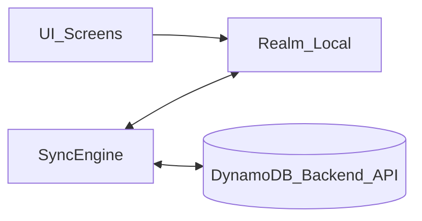

## Context (what exists today)

- **Local DB**: WatermelonDB wired in [`/Users/ehsanahmad/Desktop/Dev/react-native/expo/expo-new/expo-new-app/db/index.ts`](/Users/ehsanahmad/Desktop/Dev/react-native/expo/expo-new/expo-new-app/db/index.ts), schema v3 in [`/Users/ehsanahmad/Desktop/Dev/react-native/expo/expo-new/expo-new-app/db/model/schema.js`](/Users/ehsanahmad/Desktop/Dev/react-native/expo/expo-new/expo-new-app/db/model/schema.js), migrations in [`/Users/ehsanahmad/Desktop/Dev/react-native/expo/expo-new/expo-new-app/db/model/migrations.js`](/Users/ehsanahmad/Desktop/Dev/react-native/expo/expo-new/expo-new-app/db/model/migrations.js), `Task` model in [`/Users/ehsanahmad/Desktop/Dev/react-native/expo/expo-new/expo-new-app/db/model/Task.js`](/Users/ehsanahmad/Desktop/Dev/react-native/expo/expo-new/expo-new-app/db/model/Task.js).
- **UI reads local** via `withObservables` in:
  - [`/Users/ehsanahmad/Desktop/Dev/react-native/expo/expo-new/expo-new-app/app/(tabs)/index.tsx`](</Users/ehsanahmad/Desktop/Dev/react-native/expo/expo-new/expo-new-app/app/(tabs)/index.tsx>)
  - [`/Users/ehsanahmad/Desktop/Dev/react-native/expo/expo-new/expo-new-app/app/(tabs)/more.tsx`](</Users/ehsanahmad/Desktop/Dev/react-native/expo/expo-new/expo-new-app/app/(tabs)/more.tsx>)
  - [`/Users/ehsanahmad/Desktop/Dev/react-native/expo/expo-new/expo-new-app/app/sync/index.tsx`](/Users/ehsanahmad/Desktop/Dev/react-native/expo/expo-new/expo-new-app/app/sync/index.tsx)
- **Offline queue** is custom in [`/Users/ehsanahmad/Desktop/Dev/react-native/expo/expo-new/expo-new-app/utils/syncQueue.ts`](/Users/ehsanahmad/Desktop/Dev/react-native/expo/expo-new/expo-new-app/utils/syncQueue.ts) (filters by `sync_status`, pushes to Supabase, updates `sync_status`).
- **There’s also Watermelon’s `synchronize()`** approach in [`/Users/ehsanahmad/Desktop/Dev/react-native/expo/expo-new/expo-new-app/utils/sync.ts`](/Users/ehsanahmad/Desktop/Dev/react-native/expo/expo-new/expo-new-app/utils/sync.ts).
- **Remote API layer** is Supabase today under [`/Users/ehsanahmad/Desktop/Dev/react-native/expo/expo-new/expo-new-app/api/tasks/*`](/Users/ehsanahmad/Desktop/Dev/react-native/expo/expo-new/expo-new-app/api/tasks/api.ts).

## Decisions you confirmed

- **Local data migration**: OK to wipe local DB when switching to Realm.
- **Comments/media shape**: Embed on Task (arrays) rather than separate local tables.

## Target architecture (Realm + DynamoDB-style documents)

- **Realm is the single source of truth for UI.**
- **Sync engine is the only layer talking to the backend.**
- **Task is a document-like object** containing scalar fields + embedded arrays:
  - `comments: CommentEmbedded[]`
  - `media: MediaEmbedded[]`
  - (and/or denormalized `commentsCount`, `mediaCount` if you want cheap list rendering)

## Plan

### 1) Add Realm dependencies + Expo/RN integration

- Add `realm` and `@realm/react`.
- Remove WatermelonDB dependencies once the migration is complete:
  - `@nozbe/watermelondb`
  - `@babel/plugin-proposal-decorators` (only if it’s no longer needed elsewhere)
- Validate Expo/RN build setup still works after removing Watermelon (this repo currently uses it in multiple screens).

### 2) Create Realm schema matching the current Task model + new embedded arrays

- Create a new Realm layer (suggested new folder):
  - `db/realm/schemas/Task.ts` (Task object)
  - `db/realm/schemas/TaskCommentEmbedded.ts` (embedded)
  - `db/realm/schemas/TaskMediaEmbedded.ts` (embedded)
  - `db/realm/index.ts` (exports schema list + types)
- Map from current Watermelon fields to Realm fields:
  - Keep your existing offline flags semantics from `SyncStatus` (`pending_creation`, `pending_update`, `sync_error`, `synced`) but move them to Realm properties.
  - Replace `server_id: number` (Supabase bigint) with a Dynamo-friendly identifier strategy:
    - default: `serverId: string | null` (or just use `id` as the backend key if your API supports client-generated IDs)
- Decide date storage format in Realm:
  - recommended: store as `Date` in Realm, convert at API boundary.

### 3) Wrap the app with a Realm provider

- Update [`/Users/ehsanahmad/Desktop/Dev/react-native/expo/expo-new/expo-new-app/app/_layout.tsx`](/Users/ehsanahmad/Desktop/Dev/react-native/expo/expo-new/expo-new-app/app/_layout.tsx) to wrap existing providers with `RealmProvider` (from `@realm/react`).
- Keep React Query for now, but stop using it for task list reads once Realm queries are in place.

### 4) Replace Watermelon “observables” in screens with Realm live queries

- Update these screens to use Realm live collections:
  - [`/Users/ehsanahmad/Desktop/Dev/react-native/expo/expo-new/expo-new-app/app/(tabs)/index.tsx`](</Users/ehsanahmad/Desktop/Dev/react-native/expo/expo-new/expo-new-app/app/(tabs)/index.tsx>)
    - Replace `withObservables` + `tasksCollection.query().observeWithColumns(...)` with `useQuery(Task)` + filtering/sorting.
    - Replace `Task` Watermelon model usage with Realm object types.
    - Ensure `commentsCount`/`mediaCount` comes from embedded arrays or denormalized fields.
  - [`/Users/ehsanahmad/Desktop/Dev/react-native/expo/expo-new/expo-new-app/app/(tabs)/more.tsx`](</Users/ehsanahmad/Desktop/Dev/react-native/expo/expo-new/expo-new-app/app/(tabs)/more.tsx>)
    - Replace `observeCount()` with a Realm query count for pending statuses.
  - [`/Users/ehsanahmad/Desktop/Dev/react-native/expo/expo-new/expo-new-app/app/sync/index.tsx`](/Users/ehsanahmad/Desktop/Dev/react-native/expo/expo-new/expo-new-app/app/sync/index.tsx)
    - Replace `observeWithColumns` + Watermelon `Q.where` filtering with Realm filtered results.

### 5) Replace `db/queries/taskApi.ts` with Realm write helpers

- Re-implement:
  - `createTask()`
  - `getTaskById()`
  - `updateTaskWithSyncStatus()`
- Ensure writes are done inside Realm write transactions, and set `syncStatus` consistently.

### 6) Rewrite the offline sync queue to be backend-agnostic (DynamoDB API)

- Update [`/Users/ehsanahmad/Desktop/Dev/react-native/expo/expo-new/expo-new-app/utils/syncQueue.ts`](/Users/ehsanahmad/Desktop/Dev/react-native/expo/expo-new/expo-new-app/utils/syncQueue.ts) to:
  - Query Realm for pending tasks by `syncStatus`.
  - Push creations/updates/deletes to your new backend API.
  - On success: mark task `synced` and clear errors.
  - On failure: mark `sync_error` and store error message.
- Replace Supabase calls with a new backend client module (recommended new files):
  - `api/backend/tasks.ts` (or `services/apis/tasks.ts` if you want to align to the workspace convention going forward)

### 7) Implement a Realm-based pull/push sync (replace `utils/sync.ts`)

- Remove Watermelon’s `synchronize()` usage in [`/Users/ehsanahmad/Desktop/Dev/react-native/expo/expo-new/expo-new-app/utils/sync.ts`](/Users/ehsanahmad/Desktop/Dev/react-native/expo/expo-new/expo-new-app/utils/sync.ts) and implement:
  - **Pull**: fetch tasks changed since `lastSyncedAt` from backend, upsert into Realm.
  - **Push**: call the queue (`pushPendingChanges`) first, then pull.
- Persist `lastSyncedAt` locally (either as a small Realm `SyncState` object or AsyncStorage). Realm `SyncState` is usually cleaner.
- Define conflict strategy (default recommendation): **last-write-wins using `updatedAt`**, with server as authority.

### 8) Remove WatermelonDB layer safely (since you’re OK wiping)

- Delete/stop using:
  - `db/model/schema.js`, `db/model/migrations.js`, `db/model/Task.js`, `db/index.ts` (Watermelon version)
  - All `@nozbe/watermelondb` imports (`Q`, `withObservables`, `Database`, `SQLiteAdapter`, etc.)
- Update docs:
  - [`/Users/ehsanahmad/Desktop/Dev/react-native/expo/expo-new/expo-new-app/OFFLINE_SYNC_GUIDE.md`](/Users/ehsanahmad/Desktop/Dev/react-native/expo/expo-new/expo-new-app/OFFLINE_SYNC_GUIDE.md)
  - [`/Users/ehsanahmad/Desktop/Dev/react-native/expo/expo-new/expo-new-app/plans/offline-first/analysis.md`](/Users/ehsanahmad/Desktop/Dev/react-native/expo/expo-new/expo-new-app/plans/offline-first/analysis.md)

### 9) Align task comments/media screens with the embedded model

- Your list UI already expects counts (`task_comments(count)` / `task_media(count)`). With embedded arrays, you can:
  - compute `commentsCount = task.comments.length`, `mediaCount = task.media.length`
  - or store `commentsCount`/`mediaCount` fields updated during sync for faster lists.
- Update edit flows that currently call Supabase comment/media APIs (under `api/tasks/comments/*` and `api/tasks/media/*`) to read/write via embedded arrays and sync.

## Notes / assumptions about your DynamoDB backend

- Backend will provide task items with at least:
  - `id`, `title`, `description`, `priority`, `isCompleted`, `createdAt`, `updatedAt`, optional `dueDate`
  - `comments[]`, `media[]` (embedded) OR counts if you prefer.
- Backend supports delta pull by `updatedAt` (typically via a GSI) and delete semantics (either tombstones `deletedAt` or a delete log).

## Acceptance criteria

- Tasks list, create, edit, delete works fully offline reading from Realm.
- Sync queue screen shows pending items based on Realm `syncStatus`.
- Manual sync triggers a push-then-pull cycle against the new backend.
- No runtime usage of `@nozbe/watermelondb` remains.

## Plan file note

- The workspace rule mentions `plans/app/phase1.md`, but it is not present in this repo path. If it exists in a different repository root, we’ll mirror these tasks there too.
