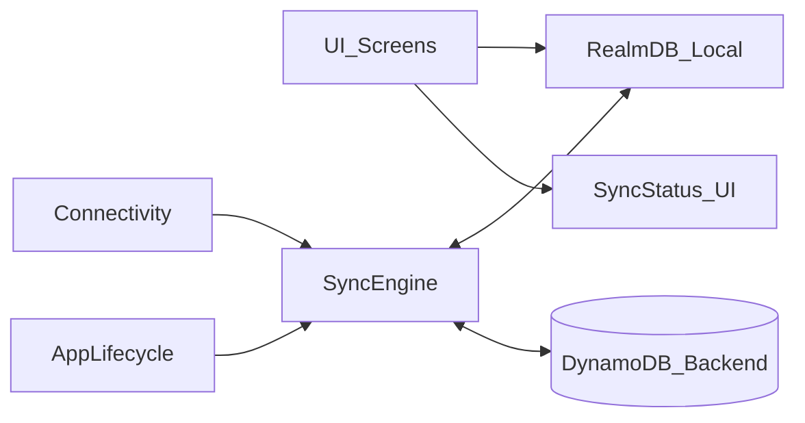

# Offline-first plan (RealmDB + DynamoDB Backend)

## Current state (after migration to Realm)

- **Offline-first architecture**: UI reads/writes via RealmDB (local source of truth).
- **Sync engine**: Custom push-then-pull sync with DynamoDB backend.
- **Document-style data**: Tasks contain embedded `comments[]` and `media[]` arrays, matching DynamoDB structure.

## Architecture

- **Local DB is the single source of truth**: screens read from RealmDB only.
- **Sync engine is the only layer talking to backend**.
- **Delta sync** based on server-authored `updatedAt` and `deletedAt`.

## Implementation details

### Realm Schema
- **Task**: Main object with embedded arrays for comments and media
- **TaskCommentEmbedded**: Embedded object (not a separate table)
- **TaskMediaEmbedded**: Embedded object (not a separate table)
- **SyncState**: Singleton object storing `lastSyncedAt`

### Sync Status Flow
1. **Create**: `sync_status = "pending_creation"` → Push to backend → `sync_status = "synced"`, store `serverId`
2. **Update**: If `sync_status !== "pending_creation"`, set to `"pending_update"` → Push → `"synced"`
3. **Error**: On push failure → `sync_status = "sync_error"`, store error message
4. **Retry**: User can retry from sync queue screen

### Date Handling
- Realm stores dates as `Date` objects
- Backend API uses ISO string format
- Conversion happens at API boundary

### ID Strategy
- Client generates UUID v4 for new tasks (`id` field)
- Backend returns server-assigned ID after first sync (`serverId` field)
- Both `id` and `serverId` are indexed for fast lookups

## Sync Protocol

### Push (Local → Remote)
1. Query Realm for tasks with `sync_status` in `[pending_creation, pending_update, sync_error]`
2. For each task:
   - `pending_creation` → `POST /tasks`
   - `pending_update` → `PUT /tasks/:serverId`
3. On success: mark as `synced`, store `serverId`
4. On failure: mark as `sync_error`, store error message

### Pull (Remote → Local)
1. Get `lastSyncedAt` from `SyncState` singleton
2. Call `GET /tasks?updatedSince=ISO_DATE`
3. Upsert tasks into Realm (create if not exists, update if exists)
4. Update `lastSyncedAt` in `SyncState`

## Backend API Requirements

The backend must provide:
- `POST /tasks` - Create new task (returns task with server-generated `id`)
- `PUT /tasks/:id` - Update existing task
- `DELETE /tasks/:id` - Delete task (or soft delete)
- `GET /tasks?updatedSince=ISO_DATE` - Fetch tasks updated since timestamp
- `GET /tasks` - Fetch all tasks (for initial sync)

All endpoints should accept/return tasks with embedded `comments[]` and `media[]` arrays matching the Realm schema structure.

## Migration Notes

- Migrated from WatermelonDB to RealmDB
- Local data was wiped during migration (no migration path)
- All tasks will be re-synced from backend on first sync
- Ensure backend has all existing data before switching

## Acceptance criteria

- App works fully offline for tasks create/update/delete.
- On reconnection, changes sync both ways with correct `updatedAt` ordering.
- Deletes propagate across devices (via `deletedAt` tombstones or delete log).
- No UI screen reads tasks directly from backend API.
- Sync queue screen shows pending items and allows retry.
